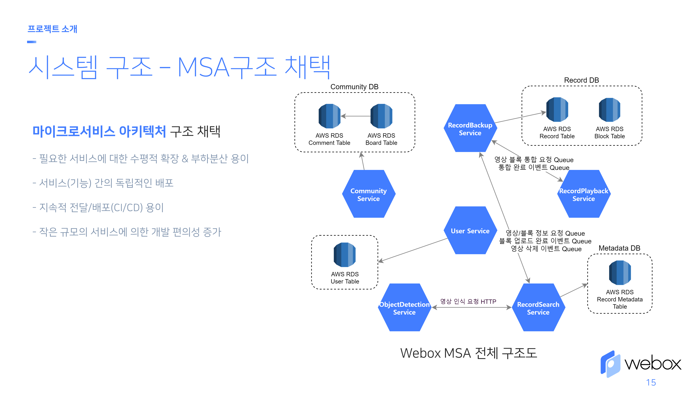

b# webox

> 2021년 소프트웨어 마에스트로 12기 백남준팀 메인 프로젝트

 

  

 

퍼스널 모빌리티를 위한 클라우드 기반 블랙박스 어플리케이션

## 목차

- [목차](#목차)
- [프로젝트 설명](#프로젝트-설명)
- [프로젝트 구조](#프로젝트-구조)
  - [구조 개요](#구조-개요)
  - [Infrastructure](#infrastructure)
  - [백엔드 서버](#백엔드-서버)
  - [영상 인식 AI](#영상-인식-ai)
  - [어플리케이션](#어플리케이션)
- [프로젝트 진행 과정 및 개발 현황](#프로젝트-진행-과정-및-개발-현황)
- [기여자 정보](#기여자-정보)
- [라이선스](#라이선스)

## 프로젝트 설명

  

퍼스널 모빌리티에 대한 블랙박스 필요성이 증가하고 있는 가운데, 퍼스널 모빌리티의 블랙박스 탑재률이 미흡하고 기존 하드웨어 블랙박스를 사용하기에는 SD카드의 용량 문제, 녹화 불량 발생 및 인지의 어려움, 개방된 공간에 노출됨에 따른 블랙박스 하드웨어 도난 위험 등 심각한 사용자 불편을 초래하고 있다.
 
 

  

그렇기에 스마트폰 거치대만 있다면 다양한 퍼스널 모빌리티를 지원할 수 있고, 클라우드 백업 서비스와 이를 이용한 부가적인 기능을 지원하는 <b>클라우드 기반 블랙박스 어플리케이션</b>인 webox를 제공함으로 위 문제들을 해결하고자 한다. 
 
 

  

webox는 다음과 같이 크게 4가지 주요기능으로 구성이 되어있다.
 
 

|퍼스널 모빌리티 블랙박스 기능|실시간 클라우드 백업 기능|
|:-:|:-:|
|||

|클라우드 백업 영상 검색 기능|영상 요청 커뮤니티 기능|
|:-:|:-:|
|||

 
webox의 4가지 주요 서비스(기능)의 구성과 흐름은 아래 서비스 구성도와 같이 되어있다.
 
 

  

## 프로젝트 구조
### 구조 개요

  

프로젝트는 크게 <b>webox 블랙박스 어플리케이션</b>과 <b>webox 클라우드 서버</b>로 구성되어 있다.

  

<b>webox 블랙박스 어플리케이션</b>은 Flutter를 이용해 개발하였고, 안드로이드와 iOS 플랫폼을 타겟으로 하고 있다.

  

<b>webox 클라우드 서버</b>는 마이크로서비스 아키텍처를 기반으로 설계하였고, 서비스들은 Nestjs(nodejs)와 Flask(python)를 이용해 개발되었다.

### Infrastructure

### 백엔드 서버

### 영상 인식 AI

### 어플리케이션

## 프로젝트 진행 과정 및 개발 현황

## 기여자 정보

[정승욱](https://github.com/wjdtmddnr24)

## 라이선스

