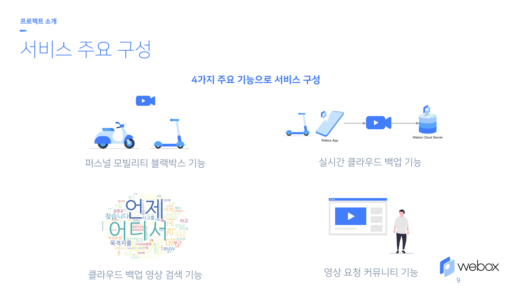
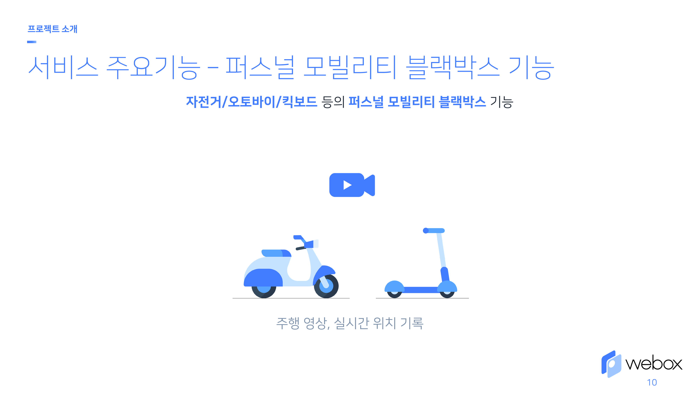
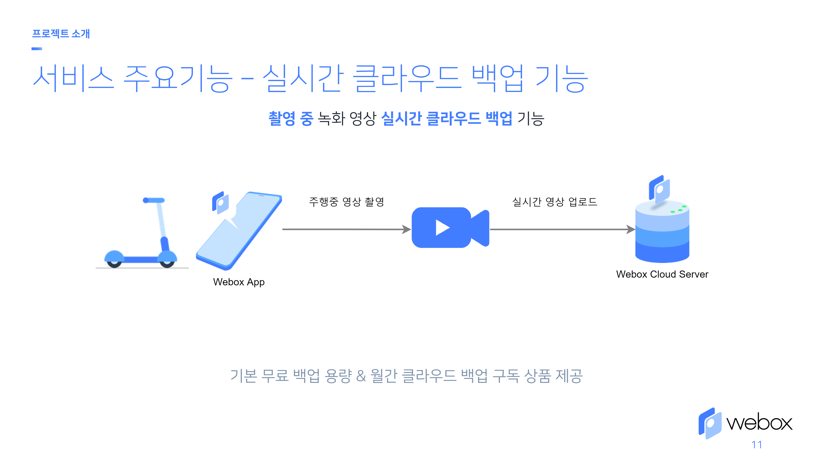
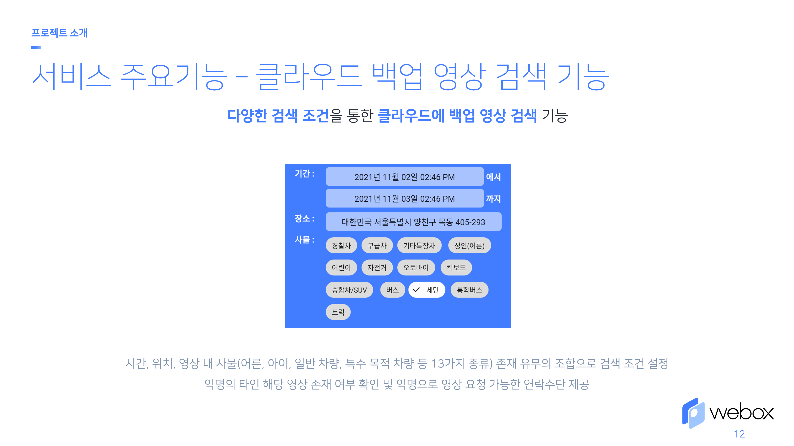
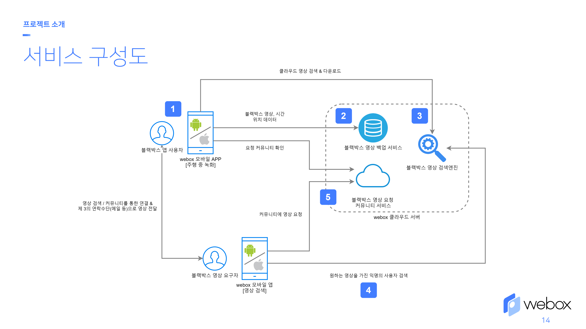

# webox

> 2021년 소프트웨어 마에스트로 12기 백남준팀 메인 프로젝트

 

  

<b>퍼스널 모빌리티를 위한 클라우드 기반 블랙박스 어플리케이션</b>

 

## 목차

- [webox](#webox)
  - [목차](#목차)
  - [프로젝트 설명](#프로젝트-설명)
  - [프로젝트 구조](#프로젝트-구조)
    - [구조 개요](#구조-개요)
    - [Infrastructure](#infrastructure)
    - [백엔드 서버](#백엔드-서버)
    - [영상 인식 AI](#영상-인식-ai)
    - [어플리케이션](#어플리케이션)
  - [프로젝트 진행 과정 및 개발 현황](#프로젝트-진행-과정-및-개발-현황)
  - [기여자 정보](#기여자-정보)
  - [라이선스](#라이선스)

## 프로젝트 설명

퍼스널 모빌리티에 대한 블랙박스 필요성이 증가하고 있는 가운데, 퍼스널 모빌리티의 블랙박스 탑재률이 미흡하고 기존 하드웨어 블랙박스를 사용하기에는 SD카드의 용량 문제, 녹화 불량 발생 및 인지의 어려움, 블랙박스 하드웨어가 개방된 공간에 노출됨에 따른 도난 위험 등 심각한 사용자 불편을 초래하고 있다.

그렇기에 스마트폰 거치대만 있다면 다양한 퍼스널 모빌리티를 지원할 수 있고, 클라우드 백업 서비스와 이를 이용한 부가적인 기능을 지원하는 **클라우드 기반 블랙박스 어플리케이션**인 **webox**를 제공함으로 위 문제들을 해결하고자 한다. 

**webox**는 크게 4가지 주요기능으로 구성되어 있으며 세부 내용은 아래의 표와 같다.

|퍼스널 모빌리티 블랙박스 기능|실시간 클라우드 백업 기능|
|:-:|:-:|
|||

|클라우드 백업 영상 검색 기능|영상 요청 커뮤니티 기능|
|:-:|:-:|
|||

**webox**의 4가지 주요 서비스(기능)의 구성과 흐름은 위 서비스 구성도와 같이 되어있다.

 

## 프로젝트 구조
### 구조 개요

프로젝트는 크게 **webox 블랙박스 어플리케이션**과 **webox** 클라우드 서버로 구성되어 있다.

**webox 블랙박스 어플리케이션**은 안드로이드와 iOS 플랫폼을 타겟으로 동시 개발을 위해 Flutter를 이용해 개발하였다.

**webox 클라우드 서버**는 높은 실시간 영상 업로드 트래픽, 지속적인 전달/배포의 용의성, 개발 편의성 등을 고려하여 마이크로서비스 아키텍처를 기반으로 설계하였다. 

### Infrastructure
<!-- TODO: 서버 아키텍처 다이어그램 설명 -->

webox 백엔드 서버의 인프라는 AWS를 적극 활용하였다. 각 서비스 컨테이너를 관리하기위해 매니지드 쿠버네티스인 EKS를 사용하고, RabbitMQ 메시지 큐를 사용하기 위해 Amazon MQ를 사용했으며, 데이터베이스로 AWS RDS, 영상 데이터 파일 관리로 AWS S3, 이외에 AWS API Gateway, AWS ECR, Route53 등을 사용하였다. 
<!-- TODO: 쿠버네티스 설명 -->

쿠버네티스를 사용
<!-- TODO: CI/CD 파이프라인 설명  -->

  
  

CI/CD 파이프라인을 생성, 활용

### 백엔드 서버
<!-- TODO: 각 서비스 설명(언어, 기능, 등등) -->

기능별로 서비스를 분리하고 개발을 진행
NestJS(TypeScript), Flask(Python)을 활용

### 영상 인식 AI

  
  

영상 인식 AI를 개발

### 어플리케이션
<!-- TODO: 영상 업로드 설명 -->

녹화영상 실시간 업로드
<!-- TODO: 화면 스크린샷 첨부 -->

## 프로젝트 진행 과정 및 개발 현황

  
  

소마 기간동안 프로젝트 진행

## 기여자 정보

[정승욱](https://github.com/wjdtmddnr24)

## 라이선스

